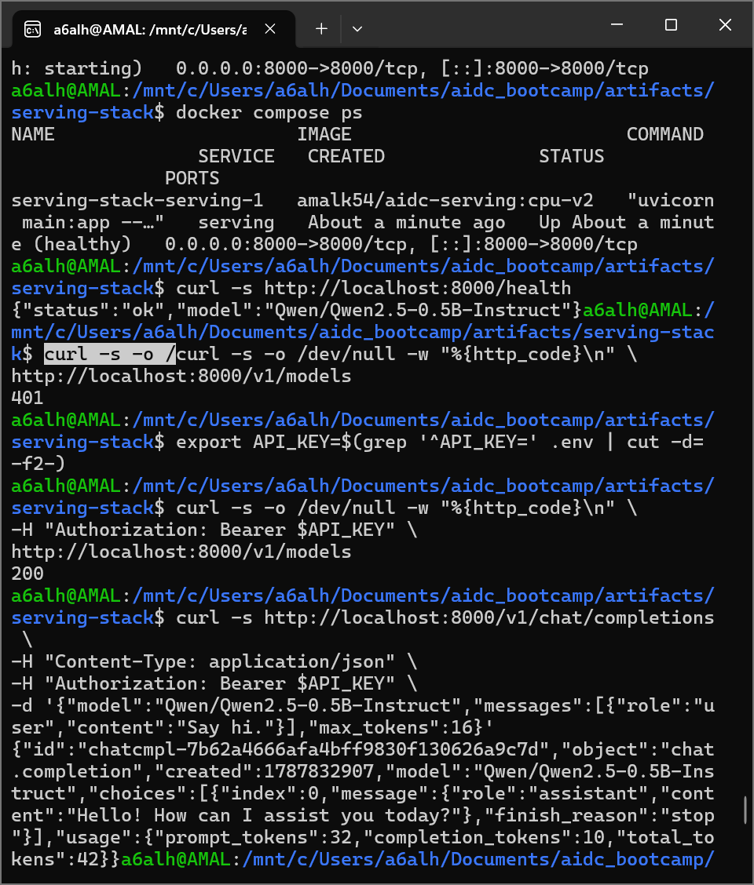

# W2D5 - Docker Compose and Service Security

## Predict (by hand)

Before bringing the service up, I made the following predictions:

- After `docker compose up -d`, how long until `docker compose ps` reports the service as `healthy`?

  **About 120 seconds.**

  The healthcheck has a `start_period` of 120 seconds to give the model enough time to load.

- If `MODEL_ID` is changed in `.env` and `docker compose up -d` is run again, does Compose recreate the container?

  **Yes.**

  Changing an environment variable used by the service changes the container configuration, so Compose recreates the container.

- The healthcheck runs inside the container. Does the base image have `curl`?

  **No.**

  The `python:3.11-slim` base image does not include `curl`, so the healthcheck uses Python instead.

- If the service port was published to the internet without authentication, how long until someone else is generating tokens on your GPU?

  **Days.**

  An exposed unauthenticated model API can be discovered and abused, causing unexpected resource consumption.

- After adding a key, which endpoint must still answer without one, and why?

  **`/health`**

  Kubernetes and container health probes need to access the health endpoint without authentication. It should remain lightweight and should not expose sensitive information.

---

## Objective

The goal of W2D5 was to move from manually running the serving container with `docker run` to managing the service with Docker Compose.

The service was configured with:

- A Docker Hub image
- Environment variables
- A persistent Hugging Face model cache
- A Docker healthcheck
- A restart policy
- Bearer token authentication
- A maximum token limit

The final checkpoint was a Compose deployment that becomes healthy and successfully serves the `/v1` API.

---

## Step 1 - Environment Configuration

Created `.env` from `.env.example`.

The configuration used:

```env
IMAGE=amalk54/aidc-serving:cpu-v2
MODEL_ID=Qwen/Qwen2.5-0.5B-Instruct
HOST_PORT=8000
API_KEY=<secret>
MAX_TOKENS=256
```

The real `API_KEY` is stored only in `.env`.

The `.env` file is gitignored and is not committed to the repository.

The `.env.example` file contains only a placeholder value and can be safely committed.

---

## Step 2 - Docker Compose

Created `compose.yaml` to define the serving service.

The service uses the Docker Hub image:

```text
amalk54/aidc-serving:cpu-v2
```

The Compose configuration includes:

```yaml
services:
  serving:
    image: ${IMAGE}
    ports:
      - "${HOST_PORT}:8000"
    environment:
      MODEL_ID: ${MODEL_ID}
      API_KEY: ${API_KEY}
      MAX_TOKENS: ${MAX_TOKENS}
    volumes:
      - hf-cache:/home/app/.cache/huggingface
    restart: unless-stopped
```

A named volume is used for the Hugging Face cache:

```yaml
volumes:
  hf-cache:
```

This allows the downloaded model files to persist across container restarts without putting the model weights inside the Docker image.

---

## Healthcheck

The service uses a Python-based healthcheck:

```yaml
healthcheck:
  test: ["CMD", "python", "-c", "import urllib.request,sys; sys.exit(0 if urllib.request.urlopen('http://localhost:8000/health').status==200 else 1)"]
  interval: 10s
  timeout: 5s
  retries: 5
  start_period: 120s
```

Python is used instead of `curl` because `curl` is not available in the `python:3.11-slim` image.

The `start_period` gives the model enough time to load before healthcheck failures are counted.

---

## Step 3 - Start the Service

The service was started using:

```bash
docker compose up -d
```

The initial status showed:

```text
health: starting
```

After the model finished loading, the service became:

```text
healthy
```

The health endpoint was tested with:

```bash
curl -s http://localhost:8000/health
```

Response:

```json
{
  "status": "ok",
  "model": "Qwen/Qwen2.5-0.5B-Instruct"
}
```

This confirmed that the service was healthy and the model was loaded successfully.

---

## Step 4 - Security and Limits

### API Key Authentication

The service was updated to read the API key from the environment:

```python
API_KEY = os.environ.get("API_KEY", "")
```

A maximum token limit was also configured:

```python
MAX_TOKENS = int(os.environ.get("MAX_TOKENS", "256"))
```

If the API key is not configured, the service logs a warning at startup.

The `/v1/*` endpoints require a Bearer token:

```text
Authorization: Bearer <API_KEY>
```

Requests without the correct key are rejected with:

```text
401 Unauthorized
```

---

## Health Endpoint

The `/health` endpoint remains unauthenticated.

This was intentional because Kubernetes and container health probes need to access the endpoint without providing an API key.

The endpoint does not run model inference and only reports the service health and model ID.

---

## Authentication Tests

### Without API Key

Tested:

```bash
curl -s -o /dev/null -w "%{http_code}\n" \
http://localhost:8000/v1/models
```

Result:

```text
401
```

This confirms that `/v1/models` is protected.

### With API Key

The key was loaded from `.env` without exposing it:

```bash
export API_KEY=$(grep '^API_KEY=' .env | cut -d= -f2-)
```

Then:

```bash
curl -s -o /dev/null -w "%{http_code}\n" \
-H "Authorization: Bearer $API_KEY" \
http://localhost:8000/v1/models
```

Result:

```text
200
```

This confirms that authenticated requests are allowed.

### Health Without API Key

```bash
curl -s -o /dev/null -w "%{http_code}\n" \
http://localhost:8000/health
```

Result:

```text
200
```

Therefore:

```text
/health -> open
/v1/*   -> protected
```

---

## Chat Completion Test

A real completion was successfully generated using:

```bash
curl -s http://localhost:8000/v1/chat/completions \
-H "Content-Type: application/json" \
-H "Authorization: Bearer $API_KEY" \
-d '{"model":"Qwen/Qwen2.5-0.5B-Instruct","messages":[{"role":"user","content":"Say hi."}],"max_tokens":16}'
```

The service returned an OpenAI-compatible response containing:

- `id`
- `object`
- `created`
- `model`
- `choices`
- `usage`

Example response:

```json
{
  "object": "chat.completion",
  "model": "Qwen/Qwen2.5-0.5B-Instruct",
  "choices": [
    {
      "message": {
        "role": "assistant",
        "content": "Hello! How can I assist you today?"
      },
      "finish_reason": "stop"
    }
  ]
}
```

---

## Step 5 - Docker Image

The updated service was rebuilt and tagged as:

```text
amalk54/aidc-serving:cpu-v2
```

The image was pushed to Docker Hub:

```bash
docker push amalk54/aidc-serving:cpu-v2
```

The updated image contains the authentication and token limit changes.

Compose was configured to use `cpu-v2` instead of the previous `cpu-v1` image.

---

## Step 6 - Verification

The W2D5 verification script was executed:

```bash
./verify.sh
```

The verification result was:

```text
service: healthy
auth: /health open, /v1 401 without key, 200 with key
completion: ok
GREEN CHECK: PASS
```


This confirms that:

1. The Compose service becomes healthy.
2. `/health` works without authentication.
3. `/v1/models` returns `401` without the key.
4. `/v1/models` returns `200` with the correct key.
5. `/v1/chat/completions` successfully generates a completion.

---

## Key Concepts Learned

### Docker Compose

Docker Compose allows the complete service configuration to be described in one `compose.yaml` file instead of repeatedly using long `docker run` commands.

### Named Volumes

The `hf-cache` volume keeps model files persistent across container restarts.

This avoids downloading the model every time the container starts.

### Environment Variables

Configuration such as:

```text
MODEL_ID
API_KEY
MAX_TOKENS
HOST_PORT
IMAGE
```

is kept outside the application code.

The `.env` file provides local configuration while `.env.example` documents the required variables without exposing secrets.

### Healthchecks

The Docker healthcheck allows Docker Compose to determine whether the service is actually ready.

The check calls:

```text
GET /health
```

from inside the container.

### API Security

The `/v1` API is protected using Bearer token authentication.

The health endpoint remains open because infrastructure health probes need access to it.

### Resource Protection

`MAX_TOKENS` provides a hard ceiling on the number of generated tokens per request, reducing the maximum resource consumption of a single request.

---

## Final Result

The Week 2 serving service was successfully moved from manual `docker run` execution to Docker Compose.

The final service:

- Uses `amalk54/aidc-serving:cpu-v2`
- Runs with Docker Compose
- Uses a persistent Hugging Face cache
- Has a working healthcheck
- Uses environment-based configuration
- Protects `/v1/*` with an API key
- Keeps `/health` publicly accessible
- Limits maximum token generation
- Successfully serves `/v1/chat/completions`
- Passed the W2D5 verification script

## Checkpoint

```text
GREEN CHECK: PASS
```
